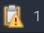
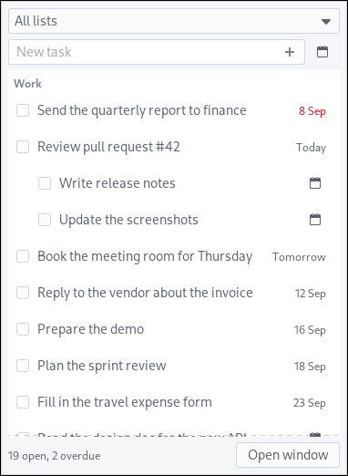
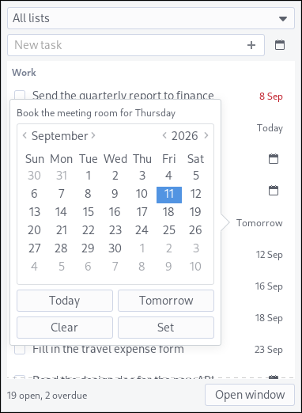
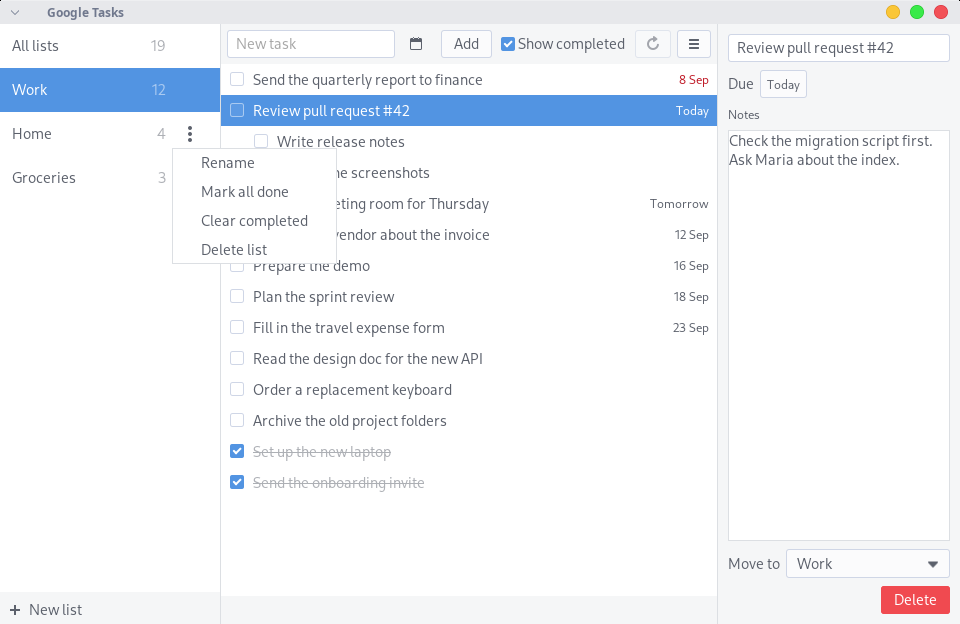
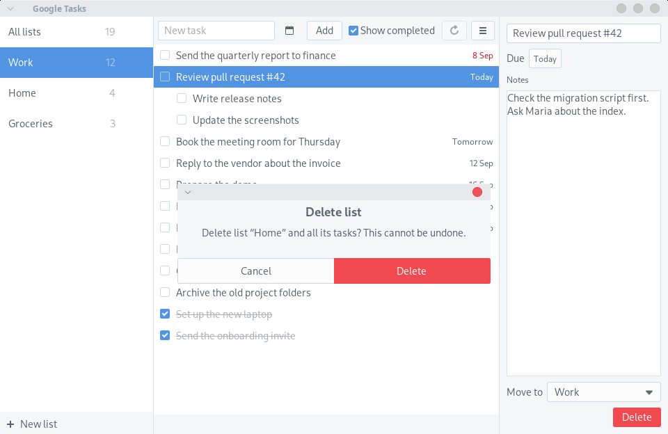
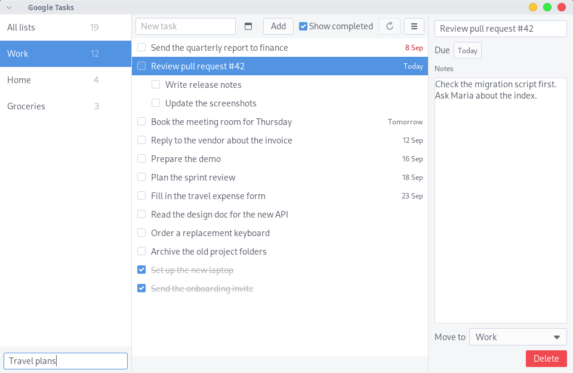

# gtasks-panel

Google Tasks counter and window for the XFCE panel.

It shows the number of open tasks in the panel. A single click opens a
small popup with your open tasks. A double click opens a full GTK
window. You sign in to Google one time. No browser window and no
second sign-in.

It uses the XFCE **Generic Monitor** plugin (genmon). Genmon runs the
`gtasks-panel` script on a timer and shows its output. There is no
compiled code.

Genmon blocks the panel while the script runs. So the script never talks
to Google directly. It reads a state file and prints it. When the file is
older than `refresh` seconds (default 300), it starts `gtasks-panel
--fetch` in the background. That process queries Google and writes the
file. The panel stays responsive when the network is slow.

## Screenshots

The panel item, and the popup that one click opens:

<p>

</p>
<p>


</p>

The full window that a double click opens, with the list menu, the
delete dialog and a new list on its way:

<p>

</p>
<p>


</p>
<p>

</p>

The tasks in the pictures are sample data.

## Install

### From the apt repo (recommended)

On a Debian or Ubuntu system with XFCE, add the signing key and the
repo one time, then install:

```
curl -fsSL https://punkch.github.io/xfce-google-tasks/gtasks-panel.gpg | sudo tee /usr/share/keyrings/gtasks-panel.gpg >/dev/null
echo "deb [signed-by=/usr/share/keyrings/gtasks-panel.gpg] https://punkch.github.io/xfce-google-tasks stable main" | sudo tee /etc/apt/sources.list.d/gtasks-panel.list
sudo apt update && sudo apt install gtasks-panel
```

New versions arrive with `sudo apt upgrade`. After an upgrade run
`gtasks-window --quit` once, so the next click starts the new version.

### From the .deb file

Download `gtasks-panel_<version>_all.deb` from the
[latest release](https://github.com/punkch/xfce-google-tasks/releases/latest)
and install it:

```
sudo apt install ./gtasks-panel_<version>_all.deb
```

### From source

```
make deb
sudo apt install ./dist/gtasks-panel_<version>_all.deb
```

The package depends on `xfce4-genmon-plugin`, `xfconf`, `python3-gi`,
`gir1.2-gtk-3.0`, and the Google API Python packages from apt.

Then do the one-time [Setup](#setup-one-time): your own OAuth client,
`gtasks-panel --auth`, `gtasks-panel --install-panel`.

### Upgrading from 0.1.0

The 0.2.0 window needs a wider sign-in scope, and the old window
process keeps running under a new package. After the upgrade:

```
gtasks-window --quit      # stop the old resident process
gtasks-panel --auth       # sign in again for the new scope
```

Without Debian:

```
sudo make install            # to /usr/local/bin
sudo make install PREFIX=/usr
```

## Setup (one time)

You need your own Google OAuth client. Google does not give a shared one,
and an API key does not work for private user data. The Tasks API has no
price. Google's limits page lists a free quota of 50,000 queries per day.
This widget uses a few hundred per day.

1. Open <https://console.cloud.google.com/>. Make a project.
2. Go to **APIs & Services → Library**. Enable **Google Tasks API**.
3. Go to **APIs & Services → OAuth consent screen**.
   - Personal Gmail account: user type **External**. After you save it,
     click **Publish app** so the status is **In production**.
   - Google Workspace account: user type **Internal**.
   - Do not leave it in **Testing**. In Testing, the sign-in expires
     after 7 days and the panel shows "sign in" again every week.
4. Go to **Credentials → Create credentials → OAuth client ID**.
   Application type **Desktop app**. Download the JSON.
5. Save the file as `~/.config/gtasks-panel/client_secret.json`.
6. Sign in. A browser opens. The app asks for the read-write scope
   `https://www.googleapis.com/auth/tasks`, because the window changes
   tasks, not only counts them.

   ```
   gtasks-panel --auth
   ```

   An unverified app shows a warning page first: **"Google hasn't
   verified this app"**. Click **Advanced**, then **Go to (your app
   name) (unsafe)**. This is normal for a personal OAuth client that
   Google has not reviewed. Accept the scope.

7. Add the panel item. The panel restarts.

   ```
   gtasks-panel --install-panel
   ```

The item appears left of the system tray. Move it with
**Panel → Panel Preferences → Items** if you want another position.

### Ship your OAuth client inside the package (optional)

Put your downloaded JSON at `share/client_secret.json` in this repo and run
`make deb` again. The package then installs it as
`/usr/share/gtasks-panel/client_secret.json`. A new install only needs
`gtasks-panel --auth`. A file in `~/.config/gtasks-panel/` still wins.
The file is in `.gitignore`. Google's docs do not state a policy on
shipping desktop-app secrets. You decide.

## The window

A click on the panel item runs `gtasks-window`. It keeps one process
resident, so the second and later clicks are fast.

- **Single click**: a popup opens under the pointer. It lists the open
  tasks of the chosen list, with a check button for each one, a
  quick-add field, a list chooser, and an "Open window" button. A
  second single click, the Escape key, or a click outside the popup
  closes it.
- **Double click**: the full window opens. Lists are on the left,
  tasks in the middle, and the details of the chosen task on the
  right. There you add tasks, change the title, the notes and the due
  date, mark a task done, move it to another list, delete it (with an
  8-second Undo bar), and turn "Show completed" on or off.

Two clicks count as a double click when they land less than 400
milliseconds apart, or less than twice the desktop's double-click
time when that is larger.

### List actions (full window)

Under the sidebar list:

- **New list**: click "New list". Type the title. Enter creates it.
  Escape cancels.
- **Rename**, **Mark all done**, **Clear completed**, **Delete list**:
  move the mouse over a list row and click the "…" button, or right
  click the row, or focus the row and press the Menu key. This opens a
  menu with the four actions. Rename turns the row into a text field;
  Enter saves the new title, Escape cancels.

Mark all done, Clear completed and Delete list ask first, with a
dialog. There is no undo: Google deletes the tasks or the list for
good. The "All lists" row has no menu. Offline, every menu entry is
grey.

### Due dates

- **Popup, on a task row**: click the date, or the calendar icon when
  the task has none, to open a small calendar. Pick Today, Tomorrow, a
  day on the calendar and Set, or Clear.
- **Quick-add** (popup and full window): click the calendar icon
  beside the add field before you press Enter. It shows the date you
  picked, and clears itself once the task is added.

A new task from the quick-add field goes to the list chosen in the
list chooser or the sidebar. With "All lists" chosen, it goes to the
list named by `default_list` in `config.ini`, or the first list when
`default_list` is empty. See `config.ini.example` for every key.

The window keeps the tasks from the last query in
`~/.cache/gtasks-panel/tasks.json` and shows them at once, before the
network reply comes back. Without a network connection it shows that
cache and a banner "Offline. Showing saved tasks."; adding, editing,
and deleting are turned off until the network is back. An error that
Google itself returns (for example, a permission problem) shows in a
red bar instead, and editing stays on.

`gtasks-window --window` opens the full window directly. The desktop
menu entry "Google Tasks" uses it. `gtasks-window --quit` stops the
resident process. Run it once after every package upgrade.

## Commands

| Command | What it does |
|---------|--------------|
| `gtasks-panel` | Print genmon XML from the state file. Genmon runs this every minute. |
| `gtasks-panel --fetch` | Query Google and update the state file. The panel starts this by itself. |
| `gtasks-panel --auth` | Sign in with Google. Then fetch one time. |
| `gtasks-panel --status` | Show paths, token state, last count, last error. |
| `gtasks-panel --install-panel [--period 60] [--panel 0]` | Add the panel item. Period minimum 30. |
| `gtasks-panel --uninstall-panel` | Remove the panel item. |
| `gtasks-panel --version` | Print the version. |
| `gtasks-window` | Panel click: popup on one click, full window on two. |
| `gtasks-window --window` | Open the full window directly. |
| `gtasks-window --quit` | Stop the resident window process. |

## Panel states

| Panel text | Meaning | Click does |
|-----------|---------|------------|
| `7` | 7 open tasks | Popup (one click) or window (two) with the tasks |
| `7?` | Last count was 7. The last refresh failed. | Same. Tooltip shows the error. |
| `…` | No count yet. A fetch runs or failed. | Same. Tooltip shows the error. |
| `setup` | `client_secret.json` is missing | Popup or window shows the path to add it |
| `sign in` | No token, or token expired, revoked, or missing the read-write scope | Popup or window shows the Sign in page |
| `!` | The script crashed | Tooltip shows the error |

The icon changes to `task-past-due` when at least one task is overdue.
Point to the item. The tooltip lists open tasks per list.

After a failed fetch the script waits 60 seconds before it tries again.

## Files

| Path | Content |
|------|---------|
| `~/.config/gtasks-panel/client_secret.json` | Your OAuth client. You add it. |
| `~/.config/gtasks-panel/config.ini` | Optional settings. See `config.ini.example`. |
| `~/.local/state/gtasks-panel/token.json` | Saved sign-in. Mode 0600. |
| `~/.local/state/gtasks-panel/state.json` | Last count, last error, sign-in state. |
| `~/.local/state/gtasks-panel/lock` | Held while a fetch runs. |
| `~/.local/state/gtasks-panel/window.json` | Size of the full window. |
| `~/.cache/gtasks-panel/tasks.json` | Tasks from the last query, mode 0600. |
| `~/.config/xfce4/panel/genmon-N.rc` | Genmon item config, written by `--install-panel`. |

## Troubleshooting

- **Panel shows `XXX`**: genmon could not start the command. Check that
  `gtasks-panel` is in `PATH` for the panel (`/usr/bin` or
  `/usr/local/bin`).
- **Panel shows `…`, `!` or `7?`**: point to the item and read the
  tooltip. Run `gtasks-panel --status` in a terminal. Run
  `gtasks-panel --fetch` to see the error directly.
- **Panel shows `sign in` every week**: the OAuth app is in Testing
  status. See Setup step 3.
- **Popup does not close when you click away**: click the panel item
  again to close it, or press Escape.
- **`sign in` comes back after an upgrade**: the new version needs the
  read-write scope. Run `gtasks-panel --auth` again.
- **Count does not change after `--auth`**: genmon updates on its
  timer (1 minute by default). Wait, or restart the panel with
  `xfce4-panel -r`.
- **The window still behaves like the old version after an upgrade**:
  a resident process from before the upgrade is still running. Run
  `gtasks-window --quit`, then click the panel item again.
- **Count does not change after a change in the window**: the window
  updates the panel item at once through a genmon plugin event. If
  that does not reach the panel, wait for the next `refresh` tick or
  run `gtasks-panel --fetch`.
- **Count is old**: a new fetch runs every `refresh` seconds (default
  300). Set a smaller value in `config.ini`. Minimum 30.

## Development

```
make check     # syntax checks, compileall, desktop-file-validate,
               # man page check, pytest (tests/)
make deb       # build dist/gtasks-panel_*.deb
make clean
```

The tests in `tests/` import the `gtasks_panel` package with the XDG
directories under a temporary path. Most of them do not need Google
packages, GTK, or network. `python3-pytest` from apt runs them.

The GTK smoke tests open real windows, so they run only on request,
under a virtual display:

```
GTASKS_UI_TESTS=1 xvfb-run -a python3 -m pytest tests/test_ui_smoke.py
```

### Releases

The version lives in `gtasks_panel/__init__.py`. `debian/changelog` is
history: `make deb` adds an entry with `dch` when the top entry is
older than that version.

A release is made on GitHub:

1. Work on `development` with conventional commits (`feat:`, `fix:`).
   The CI workflow builds and checks the package on every push.
2. Merge `development` into `main` and push. release-please opens a
   PR "chore(main): release X.Y.Z" that bumps the version and writes
   `CHANGELOG.md`.
3. Merge that PR. The Release workflow makes the tag and the GitHub
   release, builds the deb, attaches it to the release, and publishes
   the signed apt repo to the `gh-pages` branch
   (`scripts/publish-apt.sh`, `apt-ftparchive`).

The apt repo signing key is a repository secret (`GPG_PRIVATE_KEY`);
its fingerprint is the repository variable `APT_SIGNING_KEY`.
